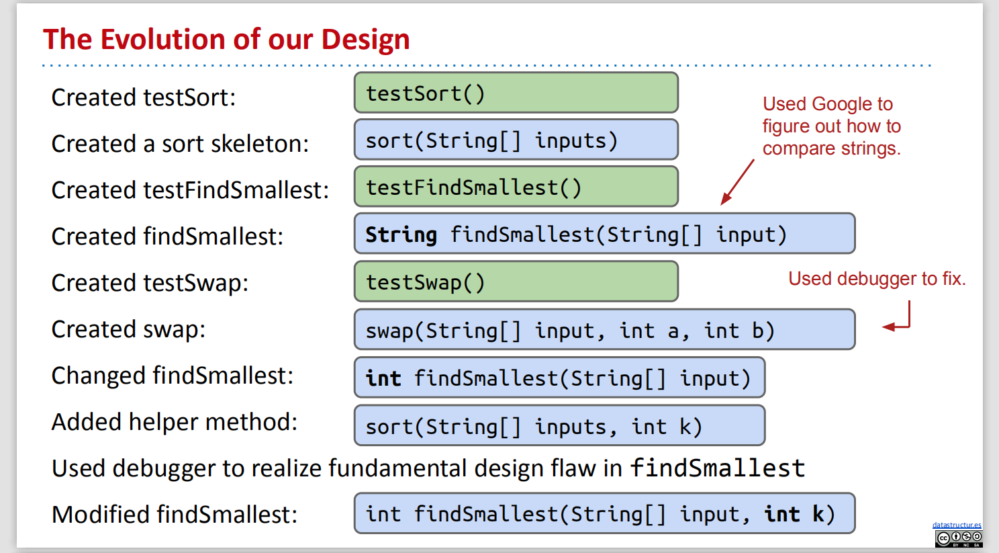
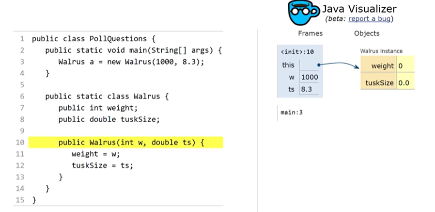
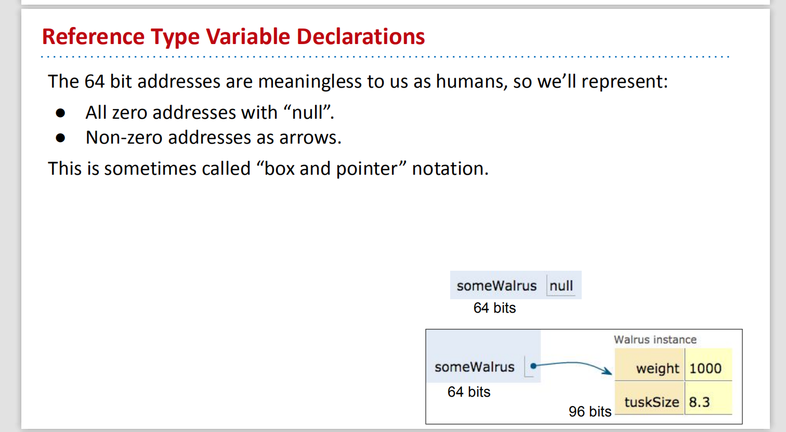
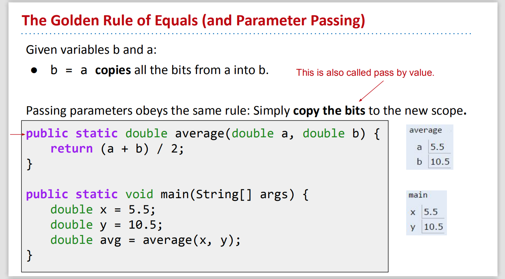

# CS61B Week 2

## Lecture 3 Testing

When you are writing programs, it's normal to have errors, and instead of using the autograder, we could write tests for ourselves.

We will write a test method `void testSort()` first to test a `sort()` method before we really implement the method.

### 1. Ad Hoc Testing

We could easily create a test, such as the code below, which will return nothing or the first mismatch of the provided arrays.

We should not use `!=` while comparing two array objects, using `!input[i].equals(expected[i])`because`!=` will simply compare the memory address pointed by the two variables.

```java
//Actual sort method
public class Sort {
	/** Sorts strings destructively. */
	public static void sort(String[] x) {
    
	}
}
```

```java
//Just to test the Sort.sort method works, this is test method
public class TestSort {
    /** Tests the sort method of the Sort class. */
    public static void testSort() {
        String[] input = {"i", "have", "an", "egg"};
        String[] expected = {"an", "egg", "have", "i"};
        Sort.sort(input); // after run, the input string need to change to meet the expected string
        
        for (int i = 0; i < input.length; i += 1) {
            if (!input[i].equals(expected[i])) {
                System.out.println("Mismatch in position " + i + ", expected: " + expected + ", but got: " + input[i] + ".");
                break;
            }// op: Mismatch in position 0, expected: an, but got: i.
        }
    }

    public static void main(String[] args) {
        testSort();
    }
}
```

### 2. JUnit

Junit is a package taht is used to debug programs in Java, some Junit functions: `assertEquals`, `assertFalse`, `assertNotNull`

With the JUnit library, our test method could be simplified to the following codes, output is pretty much same with Ad Hoc \(change for loop to just one line\)

```java
public static void testSort() {
    String[] input = {"i", "have", "an", "egg"};
    String[] expected = {"an", "egg", "have", "i"};
    Sort.sort(input);
    
    org.junit.Assert.assertArrayEquals(expected, input);
}
```

### 3. Selection Sort

Basic steps of selection sort a list of N items:

* Find the smallest item.
* Move it to the front.
* Selection sort the remaining N-1 items \(without touching the front item\).

#### **\(1\) Find the smallest item -- findSmallest\(\)**

Since `<` can't compare strings, we could use the `compareTo` method.

```java
//Actual findSmallest method
public class Sort {
    /** Sorts strings destructively. */
    public static void sort(String[] x) { 
           // (1) find the smallest item
           // (2) move it to the front
           // (3) selection sort the rest of the array (using recursion?)
           
           //(3.1)make some calls or glue two helper methods together (findSmallest and swap)
           int smallestIndex = findSmallest(x);
           swap(x, 0, smallestIndex);
           //(3)sort the rest of the array, start at position 1
    }
    
    

    /** Returns the index of the smallest string in x. */
    public static int findSmallest(String[] x) {
        int smallestIndex = 0;
        for (int i = 0; i < x.length; i += 1) {
            int cmp = x[i].compareTo(x[smallestIndex]);
         // if x[i] < x[smallestIndex], cmp will be -1
         // a < b, return -1, a = b, return 0, a >b, return 1
            if (cmp < 0) {
                smallestIndex = i;
            }
        }
        return smallestIndex;
    }
}
```

```java
//Just to test the findSmallest method works, this is test method
// Test the Sort.findSmallest method
public class TestSort {
    public static void testFindSmallest() {
        String[] input = {"i", "have", "an", "egg"};
        int expected = 2;

        int actual = Sort.findSmallest(input);
        org.junit.Assert.assertEquals(expected, actual);        

        String[] input2 = {"there", "are", "many", "pigs"};
        int expected2 = 1;

        int actual2 = Sort.findSmallest(input2);
        org.junit.Assert.assertEquals(expected2, actual2);
    }
    public static void main(String[] args) {
        testFindSmallest();    
    }
}
```

**\(2\) Move to the frong -- Swap**

```java
//Actual findSmallest method
public class Sort {
    /** Sorts strings destructively. */
    public static void sort(String[] x) { 
           // (1) find the smallest item
           // (2) move it to the front
           // (3) selection sort the rest (using recursion?)
    }
    
    /** (2) Swap item a with b*/
    public static void swap(String[] x, int a, int b) {
    String temp = x[a]; //creat temporary storage location --temp
    x[a] = x[b];
    x[b] = temp;
    }
    
    
    /** (1) Returns the smallest string in x. */
    public static String findSmallest(String[] x) {
        int smallestIndex = 0;
        for (int i = 0; i < x.length; i += 1) {
            int cmp = x[i].compareTo(x[smallestIndex]);
         // if x[i] < x[smallestIndex], cmp will be -1
         // a < b, return -1, a = b, return 0, a >b, return 1
            if (cmp < 0) {
                smallestIndex = i;
            }
        }
        return x[smallestIndex];
    }
}
```

```java
/** Test the Sort.swap method*/
public static void testSwap() {
    String[] input = {"i", "have", "an", "egg"};
    int a = 0;
    int b = 2;
    String[] expected = {"an", "have", "i", "egg"};

    Sort.swap(input, a, b);
    org.junit.Assert.assertArrayEquals(expected, input);
}
public static void main(String[] args) {
        testSwap();    
    }
```

#### \(3\) Recursive Array Helper Method & Debugging

sort the rest of the array, start at position 1

Since Java doesn't support array slicing \(`x[1:2]`\), we should add a helper method to recursively sort the whole array.

```java
//Actual findSmallest method (finished)
public class Sort {
    /** Sorts strings destructively. */
    public static void sort(String[] x) { 
        sort(x, 0);     
    }
    
    //create a helper method that sort the array starts at a particular index
    //(3) Sorts x starting at position start
    public static void sort(String[] x, int start) {
        if (start == x.length){ //fix problem: index out of bounds exception
            return;             //base case
        }
        int smallestIndex = findSmallest(x, start);
        swap(x, start, smallestIndex); //start from the position after the smallest
        sort(x, start + 1); //sort the rest of the array x, start with index start
    }
    
    
    /** (2) Swap item a with b*/
    public static void swap(String[] x, int a, int b) {
    String temp = x[a]; //creat temporary storage location --temp
    x[a] = x[b];
    x[b] = temp;
    }
    
    
    
    /** (1) Returns the index of the smallest string in x, starting at a particular start*/
    public static int findSmallest(String[] x, int start) {
        int smallestIndex = 0;
        for (int i = start; i < x.length; i += 1) {
            int cmp = x[i].compareTo(x[smallestIndex]);
         // if x[i] < x[smallestIndex], cmp will be -1
         // a < b, return -1, a = b, return 0, a >b, return 1
            if (cmp < 0) {
                smallestIndex = i;
            }
        }
        return smallestIndex;
    }
}
```

```java
//Just to test the findSmallest method works, this is test method
// Test the Sort.findSmallest method 
public class TestSort {
    public static void testFindSmallest() {
        String[] input = {"i", "have", "an", "egg"};
        int expected = 2;

        int actual = Sort.findSmallest(input, start：0);
        org.junit.Assert.assertEquals(expected, actual);        

        String[] input2 = {"there", "are", "many", "pigs"};
        int expected2 = 2;

        int actual2 = Sort.findSmallest(input2, start: 2);
        org.junit.Assert.assertEquals(expected2, actual2);
    }
    public static void main(String[] args) {
        testFindSmallest();    
    }
}
```

However, the `findSmallest` method doesn't work well since it will start from 0 instead of the start point. We could easily fix it.

```java
public static int findSmallest(String[] x, int start) {
    int smallestIndex = start;
    for (int i = start; i < x.length; i += 1) {
        int cmp = x[i].compareTo(x[smallestIndex]);
        if (cmp < 0) {
            smallestIndex = i;
        }
    }
    return smallestIndex;
}
```



The code is finally done!

#### \(4\) Enhanced JUnit Test

To allow IntelliJ to automatically run the tests, we could modify our test structure as the following rules:

* Annotate each test with the `@org.junit.Test`
* Change all test methods to non-static.
* Intellij provides a default runner, so OK to delete main
* put `import org.junit.Test;` at the top of the code, then change `@org.junit.Test` to `@Test` at the beginning of each test
* put `import static org.junit.Assert.*;` at the top of the code, then can delete `org.junit.Assert` in every test

## Lecture 4 References, Recursion, and Lists

### 1. Primitive Types

#### **\(1\) Mystery of Walrus**

The code below will both change the weight of Walrus a and b.

```java
Walrus a = new Walrus(1000, 8.3); // a weight = 1000
Walrus b;
b = a;
b.weight = 5; // change b affect a's weight to 5 too
System.out.println(a);
System.out.println(b);
```

However, the code below will only change integer x to 2.

```java
int x = 5;
int y;
y = x;
x = 2; // change x doesn't affect y
System.out.println("x is: " + x);
System.out.println("y is: " + y);
```

**\(2\) Bits**

Information is stored in memory of computers, which is a sequence of ones and zeros, called bits. The identical sequence may have different meanings, since each Java type has a different way to interpret bits. For instance, '01001000' may represent integer 72 or character 'H' based on diff context.

Java has 8 **primitive types**: `byte`, `short`, `int`, `long`, `float`, `double`, `boolean`, `char`. 

#### \(3\) Declaring a Primitive Variable

When declare a var of certain type, eg: `int x`; `doudble y`;  

* Java creates two __internal tables that have each variable name to a location. 
* Java set aside exactly enough bits to hold a thing. `int` box of 32 bits, `double`box of 64bits
* Java does not write anything into the reserved boxes
* Java does not allow access to an uninitialiized variable.

#### \(4\) Assignment

x = -143577468;  y = 567826.8789; fill the two empty reserved boxes with bits

Simplified Box Notation: Instead of writing memory box contents in binary, we write them in human readable symbols = fill the two empty reserved boxes with those two numbers.

The Golden Rule of Equals \(GRoE\): y = x , copies all the bits from x into y. 

### 2. Reference Types

Every type not included in the primitive types is a **reference type**, such as `planet`, `walrus`, `Array`.

**\(1\) Object Instantiation**

When we instantiate an object \(eg: Dog, Walrus\), 

1. Java first allocates a box of bits for each instance variable of the class and fills them with a default value \(eg: 0, null\) `Walrus a = new Walrus (int w, double ts)`. 
2. Then ehe constructer usually fill every such box with other values.

`new` returning the value, or the number of bits in memory, means where put the Walrus, so now you know where to find the Walrus in the future  



**\(2\) Declaring a Reference Variable** 

When we declare a variable of any reference type:

* Java allocates a box of size 64 bits, no matter what type of object
* These bits can be either set to Null \(all zeros\) or the address of a specific instance of that class \(returned by `new`\).

Eg1: `Walrus someWalrus;` -- create a box of 64 bits,  `someWalrus = null;` -- set it all equal to zero

Eg2: `Walrus someWalrus;` -- create a box of 64 bits,  `someWalrus = new Walrus (1000, 8.3);` -- new to find a address to put the Walrus, as a record of this informaiton, so the location/address is 64 bits, but the Walrus itself is 96 bits



#### \(3\) Obey The Golden Rule of Equals

When you write `y = x`, you are telling the Java interpreter to **copy the bits** from x into y.

Just as with primitive types, the equals sign copies the bits stored in the reference variable, which is **the address of a specific instance.** 

1. `Walrus a;` -- creates a box of 64 bits
2. `a = new Walrus (1000, 8.3);` -- `new` goes out to the memory,  find the bits it needs, 96 bits, and shouts the location/ address
3. `Walrus b;` -- creates a box of 64 bits
4. `b = a;` -- b point at the same object


#### \(4\) Passing Parameters to Functions

obey the Golen Rule of Equals, making actual copy of the bits to the new scope called **pass by value**



1. run `main`, create two double var x and y, each of them is 64 bits, fill the boxes with 5.5 and 10.5
2. make a call for the average function, = take the main boxes bits, copy to the average function, then store them in it's own scope, then have the local average boxes a and b, so it's actual bits copy to the average boxes=pass by value
3. In java, you always pass by value, = you always copy the bits


#### Arrays

Arrays are also objects, which are instantiated using the `new` keyword.

* Creates a 64 bit box for storing an array address. \(Declaration\)
* Creates a new array object. \(Instantiation\)
* Puts the address of this new object into the 64 bit box. \(Assignment\)

```java
int[] x; // Declaration
new int[] {0, 1, 2, 3}; // Instantiation
int[] x = new int[] {0, 1, 2, 3}; // Declaration, Instantiation, Assignment
```

### 3. Linked Data Structures

#### IntLists

Here's a very basic linked list:

```text
public class IntList {
    public int first;
    public IntList rest;        

    public IntList(int f, IntList r) {
        first = f;
        rest = r;
    }
}
```

There are two ways to create a list of the numbers 5, 10, and 15: build it forward or backward.

```text
IntList L = new IntList(5, null);
L.rest = new IntList(10, null);
L.rest.rest = new IntList(15, null);
```

```text
IntList L = new IntList(15, null);
L = new IntList(10, L);
L = new IntList(5, L);
```

We will add methods to the IntList class to let it perform basic tasks.

**size\(\) and iterativeSize\(\)**

We could either use recursive or iterative methods to get the size of the IntList.

```text
public int size() {
    if(this.rest == null) {
        return 1;
    } else {
        return 1 + rest.size();
    }
}

public int iterativeSize() {
    IntList p = this;
    int totalSize = 0;
    while (p != null) {
        totalSize += 1;
        p = p .rest;
    }
    return totalSize;
}
```

**get\(\)**

Write a method `get(int i)` that returns the ith item of the list.

```text
public int get(int i) {
    if (i == 0) {
        return this.first;
    } else {
        return this.rest.get(i - 1);
    }
}
```

