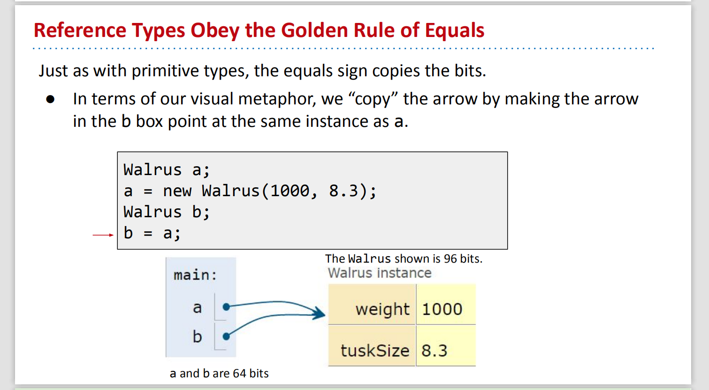
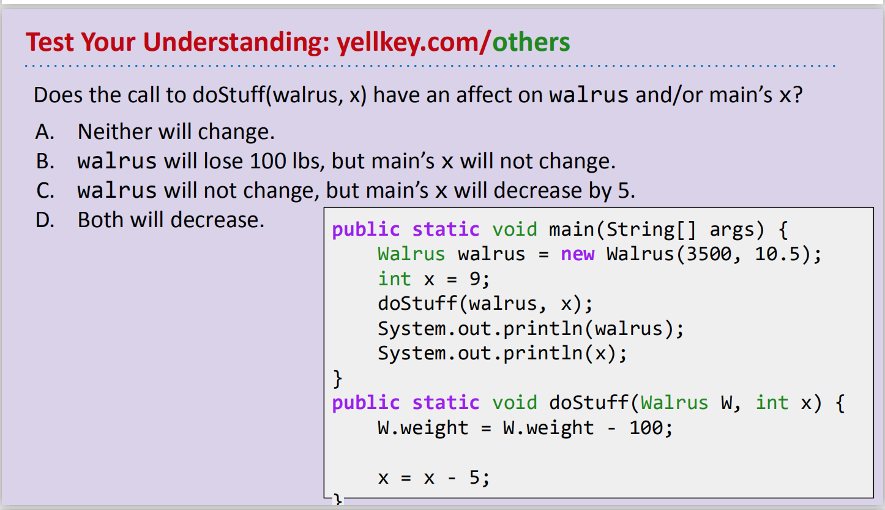
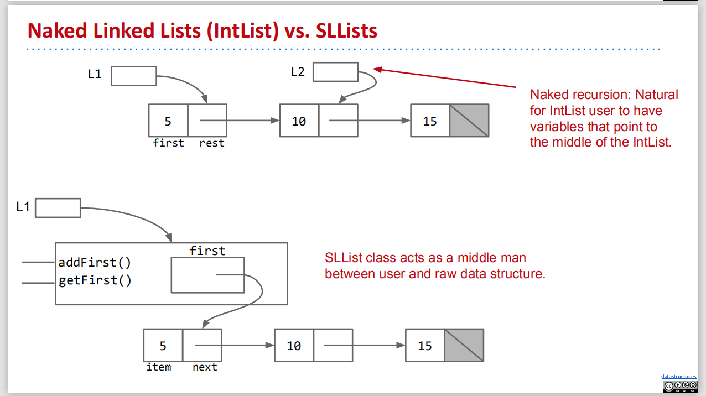
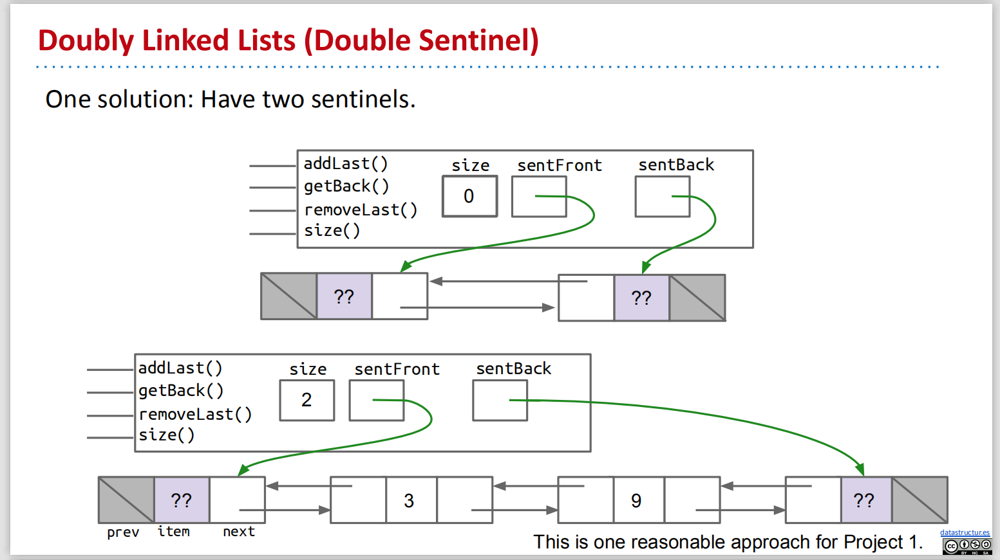
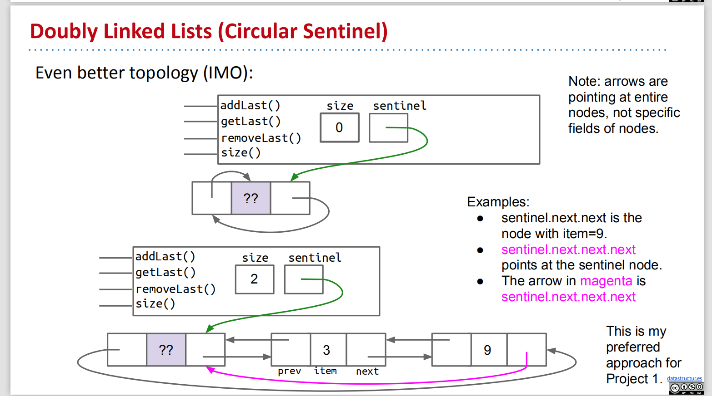

# CS61B Week 2

## Lecture 3 Testing

When you are writing programs, it's normal to have errors, and instead of using the autograder, we could write tests for ourselves.

We will write a test method `void testSort()` first to test a `sort()` method before we really implement the method.

### 1. Ad Hoc Testing

We could easily create a test, such as the code below, which will return nothing or the first mismatch of the provided arrays.

We should not use `!=` while comparing two array objects, using `!input[i].equals(expected[i])`because`!=` will simply compare the memory address pointed by the two variables.

```java
//Actual sort method
public class Sort {
	/** Sorts strings destructively. */
	public static void sort(String[] x) {
    
	}
}
```

```java
//Just to test the Sort.sort method works, this is test method
public class TestSort {
    /** Tests the sort method of the Sort class. */
    public static void testSort() {
        String[] input = {"i", "have", "an", "egg"};
        String[] expected = {"an", "egg", "have", "i"};
        Sort.sort(input); // after run, the input string need to change to meet the expected string
        
        for (int i = 0; i < input.length; i += 1) {
            if (!input[i].equals(expected[i])) {
                System.out.println("Mismatch in position " + i + ", expected: " + expected + ", but got: " + input[i] + ".");
                break;
            }// op: Mismatch in position 0, expected: an, but got: i.
        }
    }

    public static void main(String[] args) {
        testSort();
    }
}
```

### 2. JUnit

Junit is a package that is used to debug programs in Java, some Junit functions: `assertEquals`, `assertFalse`, `assertNotNull`

With the JUnit library, our test method could be simplified to the following codes, output is pretty much same with Ad Hoc \(change for loop to just one line\)

```java
public static void testSort() {
    String[] input = {"i", "have", "an", "egg"};
    String[] expected = {"an", "egg", "have", "i"};
    Sort.sort(input);
    
    org.junit.Assert.assertArrayEquals(expected, input);
}
```

### 3. Selection Sort

Basic steps of selection sort a list of N items:

* Find the smallest item.
* Move it to the front.
* Selection sort the remaining N-1 items \(without touching the front item\).

#### **\(1\) Find the smallest item -- findSmallest\(\) method**

Since `<` can't compare strings, we could use the `compareTo` method.

```java
//Actual findSmallest method
public class Sort {
    /** Sorts strings destructively. */
    public static void sort(String[] x) { 
           // (1) find the smallest item
           // (2) move it to the front
           // (3) selection sort the rest of the array (using recursion?)
           
           //(3.1)make some calls or glue two helper methods together (findSmallest and swap)
           int smallestIndex = findSmallest(x);
           swap(x, 0, smallestIndex);
           //(3)sort the rest of the array, start at position 1
    }
    

    /** Returns the index of the smallest string in x. */
    public static int findSmallest(String[] x) {
        int smallestIndex = 0;
        for (int i = 0; i < x.length; i += 1) {
            int cmp = x[i].compareTo(x[smallestIndex]);
         // if x[i] < x[smallestIndex], cmp will be -1
         // a < b, return -1, a = b, return 0, a >b, return 1
            if (cmp < 0) {
                smallestIndex = i;
            }
        }
        return smallestIndex;
    }
}
```

```java
//Just to test the findSmallest method works, this is test method
// Test the Sort.findSmallest method
public class TestSort {
    public static void testFindSmallest() {
        String[] input = {"i", "have", "an", "egg"};
        int expected = 2;

        int actual = Sort.findSmallest(input);
        org.junit.Assert.assertEquals(expected, actual);        

        String[] input2 = {"there", "are", "many", "pigs"};
        int expected2 = 1;

        int actual2 = Sort.findSmallest(input2);
        org.junit.Assert.assertEquals(expected2, actual2);
    }
    public static void main(String[] args) {
        testFindSmallest();    
    }
} // op is nothing means the method is good
```

**\(2\) Move to the front -- Swap**

```java
//Actual findSmallest method
public class Sort {
    /** Sorts strings destructively. */
    public static void sort(String[] x) { 
           // (1) find the smallest item
           // (2) move it to the front
           // (3) selection sort the rest (using recursion?)
    }
    
    /** (2) Swap item a with b*/
    public static void swap(String[] x, int a, int b) {
    String temp = x[a]; //creat temporary storage location --temp
    x[a] = x[b];
    x[b] = temp;
    }
    
    
    /** (1) Returns the smallest string in x. */
    public static String findSmallest(String[] x) {
        int smallestIndex = 0;
        for (int i = 0; i < x.length; i += 1) {
            int cmp = x[i].compareTo(x[smallestIndex]);
         // if x[i] < x[smallestIndex], cmp will be -1
         // a < b, return -1, a = b, return 0, a >b, return 1
            if (cmp < 0) {
                smallestIndex = i;
            }
        }
        return x[smallestIndex];
    }
}
```

```java
/** Test the Sort.swap method*/
public static void testSwap() {
    String[] input = {"i", "have", "an", "egg"};
    int a = 0;
    int b = 2;
    String[] expected = {"an", "have", "i", "egg"};

    Sort.swap(input, a, b);
    org.junit.Assert.assertArrayEquals(expected, input);
}
public static void main(String[] args) {
        testSwap();    
    }
```

#### \(3\) Recursive Array Helper Method & Debugging

sort the rest of the array, start at position 1

Since Java doesn't support array slicing \(`x[1:2]`\), we should add a helper method to recursively sort the whole array.

```java
//Actual findSmallest method (finished)
public class Sort {
    /** Sorts strings destructively. */
    public static void sort(String[] x) { 
        sort(x, 0);     
    }
    
    //create a helper method that sort the array starts at a particular index
    //(3) Sorts x starting at position start
    public static void sort(String[] x, int start) {
        if (start == x.length){ //fix problem: index out of bounds exception
            return;             //base case
        }
        int smallestIndex = findSmallest(x, start);
        swap(x, start, smallestIndex); //start from the position after the smallest
        sort(x, start + 1); //sort the rest of the array x, start with index start
    }
    
    
    /** (2) Swap item a with b*/
    public static void swap(String[] x, int a, int b) {
    String temp = x[a]; //creat temporary storage location --temp
    x[a] = x[b];
    x[b] = temp;
    }
    
    
    
    /** (1) Returns the index of the smallest string in x, starting at a particular start*/
    public static int findSmallest(String[] x, int start) {
        int smallestIndex = 0;
        for (int i = start; i < x.length; i += 1) {
            int cmp = x[i].compareTo(x[smallestIndex]);
         // if x[i] < x[smallestIndex], cmp will be -1
         // a < b, return -1, a = b, return 0, a >b, return 1
            if (cmp < 0) {
                smallestIndex = i;
            }
        }
        return smallestIndex;
    }
}
```

```java
//Just to test the findSmallest method works, this is test method
// Test the Sort.findSmallest method 
public class TestSort {
    public static void testFindSmallest() {
        String[] input = {"i", "have", "an", "egg"};
        int expected = 2;

        int actual = Sort.findSmallest(input, start：0);
        org.junit.Assert.assertEquals(expected, actual);        

        String[] input2 = {"there", "are", "many", "pigs"};
        int expected2 = 2;

        int actual2 = Sort.findSmallest(input2, start: 2);
        org.junit.Assert.assertEquals(expected2, actual2);
    }
    public static void main(String[] args) {
        testFindSmallest();    
    }
}
```

However, the `findSmallest` method doesn't work well since it will start from 0 instead of the start point. We could easily fix it.

```java
public static int findSmallest(String[] x, int start) {
    int smallestIndex = start;
    for (int i = start; i < x.length; i += 1) {
        int cmp = x[i].compareTo(x[smallestIndex]);
        if (cmp < 0) {
            smallestIndex = i;
        }
    }
    return smallestIndex;
}
```


The code is finally done!

#### \(4\) Enhanced JUnit Test

To allow IntelliJ to automatically run the tests, we could modify our test structure as the following rules:

* Annotate each test with the `@org.junit.Test`
* Change all test methods to non-static.
* Intellij provides a default runner, so OK to delete main
* put `import org.junit.Test;` at the top of the code, then change `@org.junit.Test` to `@Test` at the beginning of each test
* put `import static org.junit.Assert.*;` at the top of the code, then can delete `org.junit.Assert` in every test

## Lecture 4 References, Recursion, and Lists

### 1. Primitive Types

#### **\(1\) Mystery of Walrus**

The code below will both change the weight of Walrus a and b, becasue a and b point to the same box.

```java
Walrus a = new Walrus(1000, 8.3); // a weight = 1000
Walrus b;
b = a;
b.weight = 5; // change b affect a's weight to 5 too
System.out.println(a);
System.out.println(b);
```

However, the code below will only change integer x to 2, because x and y are in diff boxes.

```java
int x = 5;
int y;
y = x;
x = 2; // change x doesn't affect y
System.out.println("x is: " + x);
System.out.println("y is: " + y);
```

**\(2\) Bits**

Information is stored in memory of computers, which is a sequence of ones and zeros, called bits. The identical sequence may have different meanings, since each Java type has a different way to interpret bits. For instance, '01001000' may represent integer 72 or character 'H' based on diff context.

Java has 8 **primitive types**: `byte`, `short`, `int`, `long`, `float`, `double`, `boolean`, `char`, never use `short` and `float`

#### \(3\) Declaring a Primitive Variable

When declare a var of certain type, eg: `int x`; `doudble y`;  

* Java creates two __internal tables that have each variable name to a location. 
* Java set aside exactly enough bits to hold a thing. `int` box of 32 bits, `double`box of 64bits
* Java does not write anything into the reserved boxes = no default value
* Java does not allow access to an uninitialiized variable.

#### \(4\) Assignment

x = -143577468;  y = 567826.8789; fill the two empty reserved boxes with bits

Simplified Box Notation: Instead of writing memory box contents in binary, we write them in human readable symbols = fill the two empty reserved boxes with those two numbers.

The Golden Rule of Equals \(GRoE\): y = x , copies all the bits from x into y. 

### 2. Reference Types

Every type not included in the primitive types is a **reference type**, such as `planet`, `walrus`, `Array`.

**\(1\) Object Instantiation**

When we instantiate an object \(eg: Dog, Walrus\), 

1. Java first allocates a box of bits \(yellow boxes\) for each instance variable of the class and fills them with a default value \(eg: 0, null\), after execute the middle part in the picture, and  `Walrus a = new Walrus (1000, 8.3)`, get the below picture.
2. Then the constructer usually fill every such box with values. yellow box weight = 1000, tuskSize = 8.3. The return value of the constructor \(void\) will return the location in memory where the boxes live. The address be stored in a reference type var \(a\)
3. We use reference type var \(a\) to store the location in memory of where an object is located, and this is what the constructor returns 
4. `new` returning the value, or the number of bits in memory, means where put the Walrus, so now you know where to find the Walrus in the future  = give a the yellow boxes with values


**\(2\) Declaring a Reference Variable** 

When we declare a variable of any reference type:

* Java allocates a box of size 64 bits, no matter what type of object
* These bits can be either set to Null \(all zeros\) or the address of a specific instance of that class \(returned by `new`\).

Eg1: `Walrus someWalrus;` -- create a box of 64 bits,  `someWalrus = null;` -- set it all equal to zero

Eg2: `Walrus someWalrus;` -- create a box of 64 bits,  `someWalrus = new Walrus (1000, 8.3);` -- `new` to find a address to put the Walrus, as a record of this informaiton, so the location/address is 64 bits, but the Walrus itself is 96 bits


### 3. The Golden Rule of Equals

#### \(1\) GRoE

When you write `y = x`, you are telling the Java interpreter to **copy the bits** from x into y.

Just as with primitive types, the equals sign copies the bits stored in the reference variable, which is **the address of a specific instance.** 

GRoE: when we assign a value with equals, we are just copying the bits from one memory box to another.

1. `Walrus a;` -- creates a box of 64 bits
2. `a = new Walrus (1000, 8.3);` -- `new` goes out to the memory,  find the bits it needs, 96 bits, and shouts the location/ address
3. `Walrus b;` -- creates a box of 64 bits
4. `b = a;` -- b point at the same object



#### \(2\) Passing Parameters to Functions

obey the Golen Rule of Equals, making actual copy of the bits to the new scope called **pass by value**


1. run `main`, create two boxes labeled `x` and `y,` each of them is 64 bits, fill the boxes with 5.5 and 10.5
2. When the `average` method is invoked, it has its own scope with two new boxes labeled as `a` and `b`, and the bits are simply copied in. This copying of bits is called "pass by value".
3. m: main method, give values, call average method, pass the values to average method
4. In java, you always pass by value, = you always copy the bits
5. If the `average` method were to change `a`, then `x` in `main` would be unchanged.

#### \(3\) Example of GRoE



m: doStuff \(\(3500, 10.5\), 9\), change weight is changing the address, it's dependent, so walrus is \(3400, 10.5\) in everywhere. But, change x is just change the value not the address, it's independent, so x =4 in doStuff, but in main is still 9

### 4. Arrays

Arrays are also objects, which are instantiated using the `new` keyword.

* Creates a 64 bit box for storing an array address, no object is instantiated \(Declaration\)
* Instantiate a new array object, below is an int array. \(Instantiation\)
* Puts the address of this new object into the 64 bit box named x. \(Assignment\)
* Instantiated objects can be lost, you'd never get the orignal object back
* The size of array can't be changed after created

```java
int[] x; // Declaration
new int[] {0, 1, 2, 3}; // Instantiation
int[] x = new int[] {0, 1, 2, 3}; // Declaration, Instantiation, Assignment
```

### 5. IntList 

#### \(1\) Create IntList in Forward and Backward

* list -- linked data structure
* list is going to be larger than array, array has fixed size, list can change size
* list has two variables: first is integer called `first`, second is pointer or an address of another int list called `rest`

```java
public class IntList {
    public int first;
    public IntList rest;        

    public static void main (String[] args) {
        IntList L = new IntList();
        L.first = 5;
        L.rest = null;
        // create a new list including 5, named L
        
        L.rest = new IntList();
        L.rest.first = 10;
        
        L.rest.rest = new IntList();
        L.rest.rest.first = 15; 
        // create a list of the numbers 5, 10, and 15: build it forward     
    } 
}
```

```java
public class IntList {
    public int first;
    public IntList rest;     
    
    public IntList (int f, InList r) {
        first = f;
        rest = r;
    } // constructor   

    public static void main (String[] args) {
        IntList L = new IntList(15, null);
        L = new IntList(10, L); // L to be a list has 10 at the front, and has the old list at the back
        L = new IntList(5, L);
        // create a list of the numbers 5, 10, and 15: build it backward
    }
}
```

#### **\(2\) size\(\) and iterativeSize\(\) -- get the size of the list**

```java
public class IntList {
    public int first;
    public IntList rest;     
    
    /** Return the size of the list using recursion*/
    //prefer this method, the best solution
    public int size() { 
        if (rest == null) { //base case: rest is null, then size is 1
            return 1;
        } 
        return 1 + this.rest.size();
    }
        System.out.println(L.size());
    
    
    /** Return the size of the list using no recursion */
    public int iterativeSize() {
        IntList p = this; // create a pointer variable
        int totalSize = 0;
        while (p != null) {
            totalSize += 1;
            p = p.rest; // iterate every element in p list one by one
        }
        return totalSize;
    }
        System.out.println(L.iterativeSize());
```

When you write iterative data structure code, use the name `p` to remind yourself that the **variable is holding a pointer**

#### **\(3\). get\(\) --**get the i-th element of this IntList

```java
public int get(int i) { //L.get(0): 5  L.get(1): 10
    if (i == 0) { // do it recursively, then need base case
        return first;
    } 
    return rest.get(i - 1);
}
    System.out.println(L.get(1)); // op: 10

```

## Lecture 5 SLLists  

### 1. SLLists -- addFirst\(\) getFirst\(\) methods

The IntList class we've already created is called a 'naked' recursive data structure, which is hard to use.

#### \(1\) IntNode class \(helper\)

```java
public class IntNode {
    public int item;
    public IntNode next;

    public IntNode(int i, IntNode n) {
        item = i;
        next = n;
    }
}
```

#### \(2\) SLList class

```java
/** A SLList is a list of integers*/
public class SLList {
    public IntNode first; // m: just use IntNode to create the first item

    public SLList(int x) { // m: x is specific refer to first item, which included null
        first = new IntNode(x, null); // constructor for SLList
    }
    
    /**(3) Adds x to the front of the list*/
    public void addFirst(int x) {
        first = new IntNode(x, first); // m: (x, first) this first is 15, add another first ahead of it
    }
    
    /**(3) Return the first item in the list*/
    public int getFirst() {
        return first.item;
    }
    
    public static void main(String[] args) {
        SLList L = new SLList(15); // create a list of one integer, namely 15
        //(3) make a list 5, 10, 15, and print the first item 5
        L.addFirst(10); 
        L.addFirst(5);
        System.out.printlin(L.getFirst());
    }
}
```

Thus, we could create a list by using `new SLList(15);`15 is the first and only item, which **include null in construct**, so `SLList` is easier to instantiate, no need to specify null,  instead of using `new IntList(10, null);`.

old: `IntList L1 = new IntList(15, null);`

new: `SLList L2 = new SLList(15);`

#### \(3\) addFirst\(\) and getFirst\(\) methods to SLList

 `addFirst` method add another first item ahead of the first item just created in construtor in the exact same way with the constructor

#### \(4\) SLLists vs. IntLists



```java
SLList L = new SLList(15); //non-naked recursive data structure
L.addFirst(10); 
L.addFirst(5);
int x = L.getFirst()); //read easier
```

SLList class acts as a middle man between user and naked recursive data structure

```java
IntList L = new IntList(15, null); //naked recursive data structure
L = new IntList(10, L); 
L = new IntList(5, L);
int x = L.first; //need to understand recursive
```

Naked recursion: Natural for IntList user to have var that point to the middle of the IntList

### 2. Public to Private

Use the `private` keyword to prevent code in other classes from using members or contructors of SLList class.

```java
public class SLList {
    private IntNode first; //Don't mess with first, so change public to private
...
```

* Hide implementation details from users of your class. The user doesn't need to know we have a first var. = `private` is a signal that certain pieces of code should be ignored.
* Private variables and methods can only be accessed by code inside the same `.java` file, eg: Class `SLLTroubleMaker` can't access variable `first` in `SLList.java`
* You can change methods/ variables/ constuctors to private whenever you want
* It's just a simple way to other programmers should not use it, and it's a softer restriction by the compiler that you can't mess with it. Nothing to do with protection against hackers or other evil entities.
* Whenever you provide a public method, the world can access to that method forever. = `public` is a signal that as a declaration that a method is available and will work forever.

### 3. Nested Classes

* Combine two classes within one file when a class doesn't stand on its own and is obviously subordinate to another class.
* Make the nested class `private` if other classes should never use the nested class.
* If the nested class \(IntNode\) never uses any instance var or methods of the outer/enclosing class \(SLList\), which means IntNode class never look outwards, then declare nested class `static`. Which means nested class can't use any of the members of outer class. This results in minor memory savings

```java
public class SLList {
   
    private static class IntNode { //nested class, typically it will be on top
        public int item;
        public IntNode next;
        public IntNode(int i, IntNode n) {
            item = i;
            next = n;
        }
    }
    private IntNode first; 

    public SLList(int x) { //constructor
        first = new IntNode(x, null);
    } 
    
    /**Adds x to the front of the list*/
    public void addFirst(int x) {
        first = new IntNode(x, first);
    }
    
    /**Return the first item in the list*/
    public int getFirst() {
        return first.item;
    }
    
    public static void main(String[] args) {
        SLList L = new SLList(15); 
        L.addFirst(10); 
        L.addFirst(5);
        System.out.printlin(L.getFirst());
    }
}
```

### 4. addLast\(\) and size\(\) Methods

#### \(1\) code

```java
public class SLList {
   
    private static class IntNode { //nested class, typically it will be on top
        public int item;
        public IntNode next;
        public IntNode(int i, IntNode n) {
                item = i;
                next = n;
        }
    }
    private IntNode first; 

    public SLList(int x) { //constructor
        first = new IntNode(x, null);
    } 
    
    /**Adds x to the front of the list*/ //addFirst() method
    public void addFirst(int x) {
        first = new IntNode(x, first);
    }
    
    /**Return the first item in the list*/ //getFirst() method
    public int getFirst() {
        return first.item; 
    }
    
    /**Add an item to the end of the list*/ //addLast() method
    public void addLast(int x) {
        IntNode p = first; //do it iteratively
        /*create a pointer variable p and have it iterate through the list to the end*/
        while (p.next != null) {
            p = p.next;
        }
        p.next = new IntNode(x, null);
    }

    /**Returns the size of the list that starts at IntNode P*/ //size() method
    private static int size(IntNode p) { 
        if (p.next == null) { // do it recusively
            return 1;
        }
        return 1 + size(p.next); //naked recursive data structure
    }
    public int size() {
        return size(first);
    }
    
    
    public static void main(String[] args) {
        SLList L = new SLList(15); 
        L.addFirst(10); 
        L.addFirst(5);
        L.addLast(20);
        System.out.printlin(L.size());
    }

```

#### \(2\) size\(\) method

```java
private static int size(IntNode p) { //helper method
        if (p.next == null) { 
            return 1;
        }
        return 1 + size(p.next); 
    }
public int size() {
    return size(first);
}
```

1. IntList: size\(\) method: `return 1 + this.rest.size()`, but SLList doesn't have `rest` variable, so create a private helper method that interacts with the underlying nake recursive data structure. = When you write recursive data structure, the common strategy is, you will create a **private static recursive helper method**, which will speaks the language of Gods, then you will have a **public method \(middle man\)** call the private recursive helper method, which will speak the language of mortals\(凡人\).
2. two methods, same name \(size\) is allowed in Java, as long as they have diff parameters. We called it **overloaded.**
3. addLast\(\) method -- iterativelly,:    size\(\) -- recursively

### 5. Caching -- Fast size\(\)

Obviously, the `size()` method is unefficient, so we will add a special`size` variable `private int size;` to track/ cach the current size = anytime the size of the list changes, we update it.

caching \(超高速缓存\): putting aside data to speed up retrieval at some later date. It is redundant, but speed up

```java

public class SLList {
   
    private static class IntNode { //nested class, typically it will be on top
        public int item;
        public IntNode next;
        public IntNode(int i, IntNode n) {
                item = i;
                next = n;
        }
    }
    private IntNode first; 
    private int size;

    public SLList (int x) {
        first = new IntNode(x, null);
        size = 1;
    }

    public void addFirst(int x) {
        size += 1;
        ...
    }

    public void addLast (int x) {
        size += 1;
        ...
    }

    public int size() {
        return size; //compute the size upfront and return it
    }
```

### 6. Empty List 

```java
public class SLList {
   
    private static class IntNode { //nested class, typically it will be on top
        public int item;
        public IntNode next;
        public IntNode(int i, IntNode n) {
                item = i;
                next = n;
        }
    }
    private IntNode first; 
    private int size;
    
    /** Creates an empty SLList*/  //constructor
    public SLList() { 
        first = null;
        size = 0;
    }
    
    ...four methods
    
     public static void main(String[] args) {
        SLList L = new SLList(); //nothing in it, after run this line, it creates an empty list
        L.addFirst(10); 
        L.addFirst(5);
        L.addLast(20);
        System.out.printlin(L.size());
    }

```

Implement a **constructor** that creates an empty list. But it causes `addLast` method crash when insert into an empty list. Because in the addLast\(\) method, `p = first;` but first in the empty list is null, so p = null, then `p.nest` doesn't make sense, will cause a null pointer exception.

In order to fix the bug, we could either fix the `addLast()` method, which is not simple, or add a sentinel node.

### 7. Sentinel Node

#### \(1\) Definition

We could create a special node that is **always there**, which is called a "sentinel node". So **the empty list is just the sentinel node.** It's our faithful companion waiting for other data to get in line behind it.

The sentinel node will hold a value, which we won't care about. So ?? node can be any value, like 63.


#### \(2\) Code and Conclusion

```java
public class SLList {
   
    private static class IntNode { //nested class, typically it will be on top
        public int item;
        public IntNode next;
        public IntNode(int i, IntNode n) {
                item = i;
                next = n;
        }
    }
    
    /** The first item (if it exists) is at sentinel.next 图片*/
    private IntNode sentinel; 
    private int size;
    
    /** Creates an empty SLList*/  //constructor
    public SLList() { //set instance var to represent an empty list
        sentinel = new IntNode(63, null); //63 just a random number in order to hold something
        size = 0;
    }
    
    /** Creates one item SLList*/
    public SLList(int x) {
        sentinel = new IntNode(63, null); //same faithful companion
        sentinel.next = new IntNode(x, null); // the faithful companion point at the data we want
        size = 1;
    }

    //methods
    public void addFirst(int x) {
        sentinel.next = new IntNode(x, sentinel.next);
        size = size + 1;
    }

    public int getFirst() {
        return sentinel.next.item;
    }

    public void addLast(inx x) {
        size = size + 1;
        IntNode p = sentinel;
        
        while (p.next != null) {
            p = p.next;
        }
        p.next = new IntNode(x, null);
    }
    
    
     public static void main(String[] args) {
        SLList L = new SLList(); //nothing in it, after run this line, it creates an empty list
        L.addFirst(10); 
        L.addFirst(5);
        L.addLast(20);
        System.out.printlin(L.size());
    }
```

* The sentinel node is a faithful companion, use the same phrase, always there for you. 
* **Rename `first` var to be a `sentinel`**
* sentinel is never null, always points at sentinel node
* sentinel node's item needs to be some integer, but doesn't matter what value we pick
* had to fix constructors and methods to be compatible with sentinel nodes

### 8. Invariants

An invariant is a fact about a data structure that is guaranteed to be true during code execution.

A `SLList` with a sentinel node has at least the following invariants:

* The `sentinel` reference always points to a sentinel node.
* The front item \(if it exists\), is always at `sentinel.next`.
* The `size` variable is always the total number of items that have been added.

Invariants make it easier to reason about code:

* Can assume they are true to simplify code, give you a checklist, once methods finish running, all the invariants should be true \(eg: addLast doesn't need to worry about nulls\)
* Must ensure that methods perserve invariants

### 9. SLList Final Code & Summary

| Non-obvious Improvements |
| :--- |
| \#1 Rebranding: IntList -- IntNode |
| \#2 Bureaucracy: SLList: 1. hide null 2. addFirst\(\) and getFirst\(\) methods |
| \#3 Access Control: public -- private |
| \#4 Nested Class: 1. Bringing IntNode into SLList 2. addLast\(\) and size\(\) methods |
| \#5 Caching: Saving size as an int. |
| \#6 Generalizing: Adding a sentinel node to allow representation of the empty list. |

#### SLList better than IntList

1. simpler to use
2. more efficient addFirst method
3. avoid errors by IntList users
4. easy to implement a construtor that creates an empty list
5. IntList need to do direct pointer mannipulation, SLList as middleman to manipulate the list

## Lecture 6 DLLists

### 1. DLLists

#### \(1\) Improved addLast\(\) method -- last variable

`addLast()` method is **very slow**, because it has to walk through the entire list, like the `size()` method. We can add `last` variable to speed up code.

```java
public class SLList {
    private IntNode sentinel;
    private IntNode last;
    private int size;
    
    public void addLast(int x) {
        last.next = new IntNode(x, null);
        last = last.next; // m: create last.next, let last equals to it
        size += 1;
    }
}
```

#### \(2\) Slowed removeLast\(\) method -- secondToLast

After removing the last node, we need to find the second to last item \(9\), and then set its next pointer to be null, and last will point at 9. Adding a `secondToLast` pointer is not helpful, because then we need to find the third to last item to make sure secondToLast and Last did their job.


#### \(3\) Slowed removeLast\(\) method -- previous pointer

Add a previous pointer to each IntNode = the list now has **two links for every node,** this kinda list called "Doubly Linded List" = `DLList`

Reverse or previous pointers allow all operations \(add, get, remove\) to be fast.


#### \(4\) Double Sentinel & Circular List

**Problem:** the `last` pointer sometimes point at the sentinel, sometimes points at a real node.

**Resolution 1:** add a second sentinel at the end of the list, and point it with `sentBack`.



**Resolution 2:** use a single sentinel and make the list circular, and the front and back pointers will share the same sentinel node.

One sentinel that is both the front and the back, when you have an empty list, the previous is the sentinel itself and the next is the sentinel itself




### 2. Generic List

**DLList Limitation:** only hold integer values. We could improve our DLList to make it available for other types. 

\(1\) Specific generic type name \(arbitrary string\) inside angle brackets &lt;&gt; after class name. It acts as a placeholder for a type that is not decided at the time DLList was created. = Defer type selection until later, until we declare a var, until we instatiate a var.

```java
/** Old Code */
public class DLList {
   public class IntNode {
        public IntNode prev;
        public int item;
        public IntNode next;
        
        public IntNode(int i, IntNode n) {
			      item = i;
			      next = n;
        }
   }
   private IntNode sentinel;
   private int size;
    ...
}


/** New Code */
public class DLList<BleepBlorp> { // Generic version of DLList class
    public class StuffNode { // type is not int anymore, so change to StuffNode
        public StuffNode prev;
        public BleepBlorp item;
        public StuffNode next;
        	
        public StuffNode(BleepBlort i, StuffNode n) {
			      item = i;
			      next = n;
			  }
	  } 
    private StuffNode sentinel;
    private int size;
    //in all the methods, int changed to BleepBlorp
}
```

\(2\) Specific desired type inside of angle brackets during declaration, and also use empty angle brackets during instantiation. When run, String will substitute everywhere for BleepBlorp.

```java
DLList<String> d2 = new DLList<>("hello");
d2.addLast("world");
```

\(3\) When instantiate a generic over a primitive type, use `Integer`, `Double`, `Character`, `Boolean`, `Long`, `Short`, `Byte`, or `Float` instead of their primitive equivalents.

```java
DLList<Integer> d1 = new DLList<>(5);
d1.insertFront(10);
```

