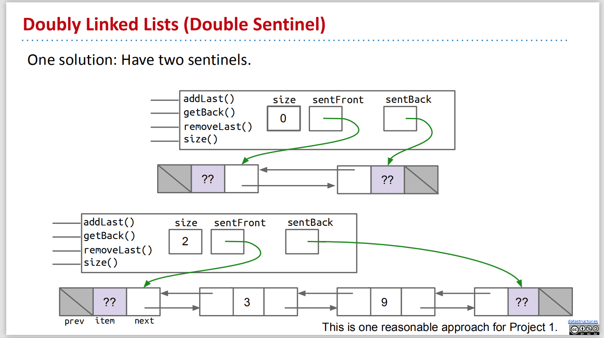
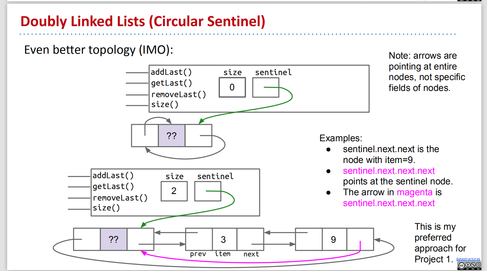
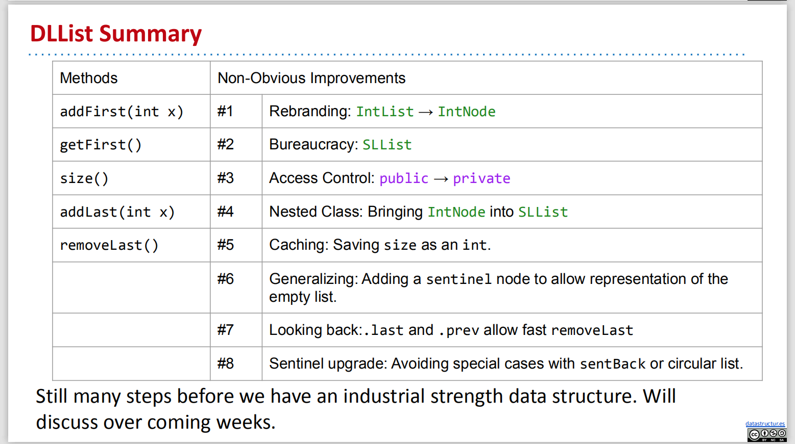

# CS61B Week 3

## Lecture 6 DLLists, Arrays

### 1. DLLists

#### \(1\) Improved addLast\(\) method -- last variable

`addLast()` method is **very slow**, because it has to walk through the entire list, like the `size()` method. We can add `last` variable to speed up code.

```java
public class SLList {
    private IntNode sentinel;
    private IntNode last;
    private int size;
    
    public void addLast(int x) {
        last.next = new IntNode(x, null);
        last = last.next; // m: create last.next, let last equals to it
        size += 1;
    }
}
```

#### \(2\) Slowed removeLast\(\) method -- secondToLast

After removing the last node, we need to find the second to last item \(9\), and then set its next pointer to be null, and last will point at 9. Adding a `secondToLast` pointer is not helpful, because then we need to find the third to last item to make sure secondToLast and Last did their job.


#### \(3\) Slowed removeLast\(\) method -- previous pointer

Add a previous pointer to each IntNode = the list now has **two links for every node,** this kinda list called "Doubly Linded List" = `DLList`

Reverse or previous pointers allow all operations \(add, get, remove\) to be fast.


#### \(4\) Double Sentinel & Circular List

**Problem:** the `last` pointer sometimes point at the sentinel, sometimes points at a real node.

**Resolution 1:** add a second sentinel at the end of the list, and point it with `sentBack`.



**Resolution 2:** use a single sentinel and make the list circular, and the front and back pointers will share the same sentinel node.

One sentinel that is both the front and the back, when you have an empty list, the previous is the sentinel itself and the next is the sentinel itself





### 2. Generic List

We could improve our IntList to make it available for other types.

```java
public class DLList<BleepBlorp> {
    private IntNode sentinel;
    private int size;

    public class IntNode {
        public IntNode prev;
        public BleepBlorp item;
        public IntNode next;
        ...
    }
    ...
}
```

We put the desired type inside of angle brackets during declaration, and also use empty angle brackets during instantiation.

```java
DLList<String> d2 = new DLList<>("hello");
d2.addLast("world");
```

#### Array Overview

#### Definition and Creation

Array is a special kind of object which consists of a numbered sequence of memory boxes. An array consists of:

* A fixed integer `length`.
* A sequence of N memory boxes where `N=length`, and all boxes hold the same type of value, which are numbered from 0 to `length-1`.

Like classes, arrays are instantiated with `new`:

```text
y = new int[3];
x = new int[]{1, 2, 3, 4, 5};
int[] w = {9, 10, 11, 12, 13};
```

**Arraycopy**

Two ways to copy arrays:

* Item by item using a loop.
* Using arraycopy: Source array, start position in source, target array, start position in target, number to copy.

```text
System.arraycopy(b, 0, x, 3, 2);
```

**2D Array**

We could create a 2-dimensional array with the following codes.

```text
int[][] matrix;
matrix = new int[4][4];
matrix = new int[4][];
matrix[0] = new int[]{1};

int[][] pascalAgain = new int[][]{{1}, {1, 1},{1, 2, 1}, {1, 3, 3, 1}};
```

**Arrays and Classes**

Both arrays and classes can be used to organize a bunch of memory boxes. In both cases, the number of memory boxes is fixed, i.e. the length of an array cannot be changed, just as class fields cannot be added or removed.

The key differences between memory boxes in arrays and classes:

* Array boxes are numbered and accessed using \[\] notation, and class boxes are named and accessed using dot notation.
* Array boxes must all be the same type. Class boxes can be different types.

## Lecture 7 ALists, Resizing, vs. SLists

#### Limitation of DLists

Suppose we added `get(int i)`, which returns the ith item of the list. While we have a quite long DList, this operation will be significantly slow.

By instead, we could use Array to build a list without links.

#### Random Access in Arrays

Retrieval from any position of an array is very fast, which is independent of the size of it.

#### Naive AList Code

```text
public class AList {
    private int[] items;
    private int size;

    public AList() {
        items = new int[100];
        size = 0;
    }

    public void addLast(int x) {
        items[size] = x;
        size += 1;
    }

    public int getLast() {
        return items[size - 1];
    }

    public int get(int i) {
        return items[i];
    }

    public int size() {
        return size;
    }
}
```

Here are some invariants of this piece of code:

* The position of the next item to be inserted is always `size`.
* `size` is always the number of items in the AList.
* The last item in the list is always in position `size - 1`.

#### Delete Operation

```text
public int removeLast() {
    int returnItem = items[size - 1];
    items[size - 1] = 0;
    size -= 1;
    return returnItem;
}
```

#### Naive Resizing Arrays

The limitation of the above data structure is that the size of array is fixed.

To solve that problem, we could simply build a new array that is big enough to accomodate the new data. For example, we can imagine adding the new item as follows:

```text
public void addLast(int x) {
  if (size == items.length) {
    int[] a = new int[size + 1];
    System.arraycopy(items, 0, a, 0, size);
    items = a;  	
  }
  items[size] = x;
  size += 1;
}
```

The problem is that this method has terrible performance when you call `addLast` a lot of times. The time required is exponential instead of linear for SLList.

Geometric resizing is much faster: Just how much better will have to wait. \(This is how the Python list is implemented.\)

```text
public void addLast(int x) {
  if (size == items.length) {
	resize(size * 2);
  }
  items[size] = x;
  size += 1;
}
```

#### Memory Performance

Our AList is almost done, but we have one major issue. Suppose we insert 1,000,000,000 items, then later remove 990,000,000 items. In this case, we'll be using only 10,000,000 of our memory boxes, leaving 99% completely unused.

To fix this issue, we can also downsize our array when it starts looking empty. Specifically, we define a "usage ratio" R which is equal to the size of the list divided by the length of the `items` array. For example, in the figure below, the usage ratio is 0.04.

#### Generic Array

When creating an array of references to Item:

* `(Item []) new Object[cap];`
* Causes a compiler warning, which you should ignore.

The another change to our code is that we will delete an item by setting it to `null` instead of `0`, which could be collected by Java Garbage Collector.

## Lecture 8 Inheritance, Implements

