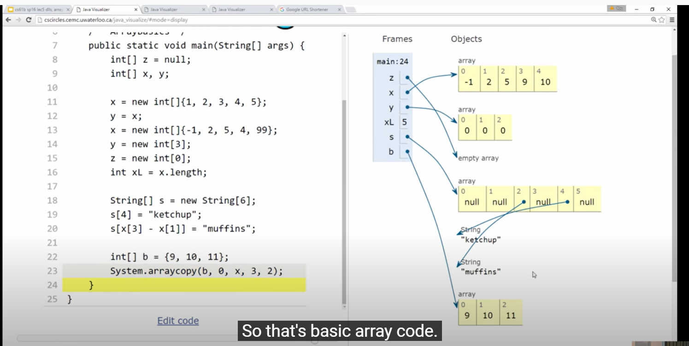

# CS61B Week 3

## Lecture 6 DLList & Arrays

### 1. DLLists

### 2.Generic List

### 3. Arrays 

Recursive class build expandable list class: Intlist, SLList, DLList

Array build array-based list and AList -- How to build a list class using arrays

#### \(1\) Definition 

Array is a special kind of object which consists of a numbered sequence of memory boxes. Unlike class instances, which have named memory boxes.

An array consists of:

* A fixed integer `length`, N, cannot change!
* A sequence of N memory boxes where `N=length`, and all boxes hold the same type of value, which are numbered from 0 to `length-1`.

Arrays do not have methods

#### \(2\) Creation

Instantiate an array:

* get one reference at the time it's created
* if you reassign all variables containing that reference, you can never get the array back

Like classes, arrays are instantiated with `new`: \(three ways to create arrays\)

```java
int [] x;
int [] y;
(1) x = new int[3]; // fill each of the 3 boxes with the default int value 0.
(2) y = new int[]{1, 2, 3, 4, 5};
(3) int[] w = {9, 10, 11, 12, 13}; // no new, declare the var at the same time, can't ust it with an already declared var
```

**\(3\) Access and Modification**

```java
int[] z = null; // an reference to an int array
int[] x, y; // create two 64 bits boxes, an address goes in each of them

x = new int[]{1, 2, 3, 4, 5}; // new: find someplace in memory for five integers to live, 32 bits for each one
  // x records the location in memory of the whole five boxes
y = x; // copy the bits
x = new int[]{-1, 2, 5, 4, 99}; // won't change y
y = new int[3]; // throw away the old bits, the array is gone will never get back 
  // = an object is anonymous = lost the reference
z = new int[0];
int xL = x.length;

String[] s = new String[6]; // each 6 box is 64 bits, holds string reference, String default value is null 
s[4] = "ketchup";
s[x[3] - x[1]] = "muffins"; // based on x array to do the math = s[2]

int[] b = {9, 10, 11};
System.arraycopy(b, 0, x, 3, 2);
// copy from array b to array x, starts at position 0 of b, copy to position 3 of x
// copy two of those numbers from b
```



#### **\(4\) Copy Array**

Two ways to copy arrays:

1. Item by item using a loop.
2. Using `arraycopy`: Source array, start position in source, target array, start position in target, number to copy.

```java
int[] x = {9, 10, 11, 12, 13};
int[] y = new int[2];
int i = 0;
while (i < x.length) {
    y[i] = x[i];
    i += 1;
}
```

**\(5\) 2D Array**

We could create a 2-dimensional array with the following codes.

```java
// method 1
int[][] matrix;
matrix = new int[4][]; // creates one array, 4 rows
matrix = new int[3][4]; // creates five arrays, 3 rows, 4 columns
matrix[0] = new int[]{1}; // first row is {1}
// method 2
int[][] pascalAgain = new int[][]{{1}, {1, 1},{1, 2, 1}, {1, 3, 3, 1}};
```

#### **\(6\) Arrays vs. Classes**

data structure: list, set, map...

Both arrays and classes can be used to organize a bunch of memory boxes. **In both cases, the number of memory boxes is fixed**, i.e. the length of an array cannot be changed, just as class fields cannot be added or removed.

The key **differences** between memory boxes in arrays and classes:

* Array boxes are numbered and accessed using \[ \] notation, and class boxes are named and accessed using dot notation.
* Array boxes must all be the same type. Class boxes can be different types.
* Array index can be computed at runtime. Class member var names cannot be computed and used at runtime.

## Lecture 7 ALists, Resizing, vs. SLists

### 1. ALists

#### \(1\) int get\(int i\)

Unlike the DLList, the AList will use arrarys to store data instead of a linked list.

**Limitation of DLists:**

Suppose we added `int get(int i)`, which returns the ith item of the list. While we have a quite long DList, this operation will be significantly slow. Because we need to walk through the list from the front to back to get to the item that we are trying to retureve.

**Solution:**

Use Array to build a list without links, because without links, there is no need to reverse them. Accessing the ith element of an array takes constant time, which is independent of the size of it.

#### \(2\) Naive AList Code -- Array based list

```java
//        0 1  2 3 4 5 6 ...
// items: 6 1 -9 0 0 0 0 ...
// size: 3

public class AList {
    private int[] items; // private: no outsider can edit our code
    private int size;

    /** Create an empty list */
    public AList() { // in constructor,need to decide what memory boxes to set up
        items = new int[100];
        size = 0;
    }

    /** Insert x into the back of the list */
    public void addLast(int x) {
        items[size] = x;
        size += 1;
    }

    /** Return the item from the back of the list */
    public int getLast() {
        return items[size - 1];
    }

    /** Get the ith item in the list (0 is the front) */
    public int get(int i) {
        return items[i];
    }

    /* Return the number of items in the list */
    public int size() {
        return size;
    }
    
    /** Delete item from back of the list and return deleted item */
    public int removeLast() {
        int returnItem = items[size - 1];
        items[size - 1] = 0; // set deleted item to 0 is not necessary
        size -= 1;
        return returnItem;
    }
}
```

**Invariants:** \(things that are always true about our data structure\)

* `addLast():` The next item we want to add, will go into position size. 
* `size:` The number of items in the List should be size
* `getLast:` The item we want to return is in position `size - 1`.

#### removeLast\(\) 

```java
// second way, better
public int removeLast() {
    int x = getLast();
    size -= 1;
    return x;
}
```

### 2. Resizing Arrays

#### \(1\) Based code

The limitation of the above data structure is that the size of array is fixed.

To solve that problem, we could simply build a new array `a` that is big enough to accomodate the new data. For example, we can imagine adding the new item as follows:

```java
int[] a = new int[size + 1];
System.arraycopy(items, 0, a, 0, size);
a[size] = 11;
item = a;
size += 1;
```

We didn't actually resize the old array, just create a copy and set the items pointer to the new array. 

#### \(2\) Add base code in addLast\(\) and resize\(\) method

```java
public void addLast(int x) {
  if (size == items.length) {
    int[] a = new int[size + 1];
    System.arraycopy(items, 0, a, 0, size);
    items = a;  	
  }
  items[size] = x;
  size += 1;
}
```

```java
/** Resizes the underlying array to the target capacity */  //much better
public void resize(int capacity) {
    int[] a = new int[capacity];
    System.arraycopy(items, 0, a, 0, size);
    items = a;  	
}

public void addLast(int x) {
    if (size == items.length) {
        resize(size + 1);	
    }
    items[size] = x;
    size += 1;
}
```

#### \(3\) Geometric Resizing -- fast AList

The problem is that this method has terrible performance when you call `addLast` a lot of times. The time required is exponential instead of linear for SLList.

Geometric resizing is much faster. Growing the size of array by a multiplicative amout, rather than an additive amount. \(This is how the Python list is implemented.\)

```java
public void addLast(int x) {
  if (size == items.length) {
	  resize(size * 2);
  }
  items[size] = x;
  size += 1;
}
```

#### \(4\) Memory Performance

An AList should not only be efficient in time, but also efficient in space.

Our AList is almost done, but we have one major issue. Suppose we insert 1,000,000,000 items, then later remove 990,000,000 items. In this case, we'll be using only 10,000,000 of our memory boxes, leaving 99% completely unused.

To fix this issue, we can also downsize our array when it starts looking empty. Specifically, we define a **"usage ratio" R** = **the size of the list / items.length** \(the length of array that represent the list\). If the usage ratio &lt; 25%, then you will half the array size. For example, the usage ratio is 4 \(size\) /100 \(length\) = 0.04.

Later we will consider tradeoffs between time and space efficiency for a variety fo algorithms and data structures.

### 3. Generic Array -- AList Final Code

#### \(1\) AList Final Code

Modify our AList so that it can hold any data type, not just integers. Use the special angle braces notation in our class, and substitute our arbitrary type paramether for integer whereever appropriate.

```java
// AList final code
public class AList<Item> {
    private Item[] items; // private: no outsider can edit our code
    private int size;

    /** Create an empty list */
    public AList() { // in constructor,need to decide what memory boxes to set up
        items = (Item[]) new Object[100]; //cast
        size = 0;
    }
    
    /** Resizes the underlying array to the target capacity */
    public void resize(int capacity) {
    Item[] a = (Item[]) new Object[capacity];
    System.arraycopy(items, 0, a, 0, size);
    items = a;  	
    }

    /** Insert x into the back of the list */
    public void addLast(Item x) {
        if (size == items.length) {
            resize(size + 1);	
        }
        items[size] = x;
        size += 1;
    }

    /** Return the item from the back of the list */
    public Item getLast() {
        return items[size - 1];
    }

    /** Get the ith item in the list (0 is the front) */
    public Item get(int i) {
        return items[i];
    }

    /* Return the number of items in the list */
    public int size() {
        return size;
    }
    
    /** Delete item from back of the list and return deleted item */
    public Item removeLast() {
    Item x = getLast();
    items[size - 1] = null; //null out deleted items
    size -= 1;
    return x;
    }
}
```

Error: Item cannot be instantiated directly. Because in Java, generic array is not allowed. We use cast to create generic array. 

```java
Item[] items = (Item[]) new Object[100]; 
```

#### \(2\) Nulling out deleted items

Unlike integer based AList, we want to null out deleted items. Java only destroys objects wehn the las reference has been lost. If we fail to null out the reference, then Java will not garbage collect the objects that have been added to the list. Keeping references to unneeded objects is called loitering.

So change to our code is that we will delete an item by setting it to `null` instead of `0`, which could be collected by Java Garbage Collector.

## Lecture 8 Inheritance, Implements

#### Method Overloading

Suppose we have the method below, which will return the longest string in a `SLList`.

```text
public static String longest(SLList<String> list) {
    int maxDex = 0;
    for (int i = 0; i < list.size(); i += 1) {
        String longestString = list.get(maxDex);
        String thisString = list.get(i);
        if (thisString.length() > longestString.length()) {
            maxDex = i;
        }
    }
    return list.get(maxDex);
}
```

However, since `SLList` and `AList` have exactly the same structure, we could write two `longest` methods to make it compatible with both classes, which is a feature called "method overloading" in Java.

```text
public static String longest(SLList<String> list)
public static String longest(AList<String> list)
```

The disadvantage of method overloading is that it makes the source code quite longer than usual and add more codes to maintain.

#### Hypernyms, Hyponyms, and Interface Inheritance

In Java, in order to express the hierarchy, we need to do two things:

* Define a type for the general list hypernym -- we will choose the name List61B.
* Specify that SLList and AList are hyponyms of that type.

First, we will create a `List61B` interface, which is a contract that specifies a list of method a list must able to do:

```text
public interface List61B<Item> {
    public void addFirst(Item x);
    public void add Last(Item y);
    public Item getFirst();
    public Item getLast();
    public Item removeLast();
    public Item get(int i);
    public void insert(Item x, int position);
    public int size();
}
```

Next, we will modify the definition of both classs to make a promise that both of them implement all the method defined in the interface `List61B`.

```text
public class SLList<Item> implements List61B<Item>{...}
public class AList<Item> implements List61B<Item>{...}
```

Now we can edit our `longest` method to take in a `List61B`. Because `AList` and `SLList` share an "is-a" relationship.

#### Method Overriding

Method overriding means that you implement a method as the same structure as it is defined in a interface, while overloaded methods could have different parameters. In this course, we will add `@Override` tag above each overrided methods. Although this tag is unnecessary, it's useful in debugging.

Different from the Golden Rules of Equal, if X is a subclass of Y, the memory box of X may contain Y. For instance, this piece of code will works well:

```text
public static void main(String[] args) {
    List61B<String> someList = new SLList<String>();
    someList.addFirst("elk");
}
```

#### Implementation Inheritance

Typically, we can't add specific implementation to a interface. However, We could add a `default` key word for a method in a interface to allow subclasses to inhert it. Although `SLList` or `AList` does not implement the `print` method in their classes, it will still work.

```text
default public void print() {
    for (int i = 0; i < size(); i += 1) {
        System.out.print(get(i) + " ");
    }
    System.out.println();
}
```

In order to re-implement the default method in a subclass, we must use the `Override` tag, or the default one will be invoked.

**Dynamic Method Selection**

In Java, variables have two phases of types: static type and dynamic type. In the code below, `lst` has a static type of `List61B` and a dynamic type `SLList`. When Java runs a method that is overriden, it searches for the appropriate method signature in it's **dynamic type** and runs it.

```text
List61B<String> lst = new SLList<String>();
```

**Method Selection Algorithm**

Suppose we have a function `foo.bar(x1)`, where `foo` has the static type `TPrime`, and `x1` has the static type `T1`.

**Compile**

When compiling the code, compiler verifies that `TPrime` has at least one method that could handle `T1`, and will record the most **specific** one.

**Run**

When running the code, if `foo`'s dynamic type **override** the `bar` method in `TPrime`, use the overridden method. Otherwise, use the recorded method.

#### Interface Inheritance vs Implementation Inheritance

* Interface inheritance \(what\): Simply tells what the subclasses should be able to do.
* Implementation inheritance \(how\): Tells the subclasses how they should behave.

